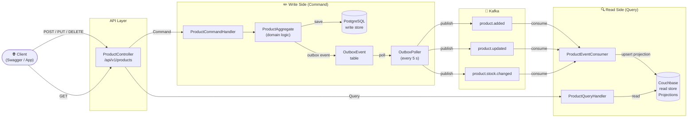
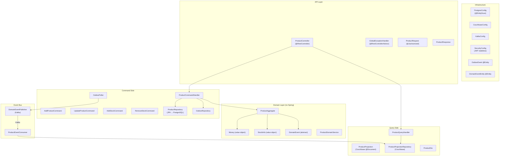
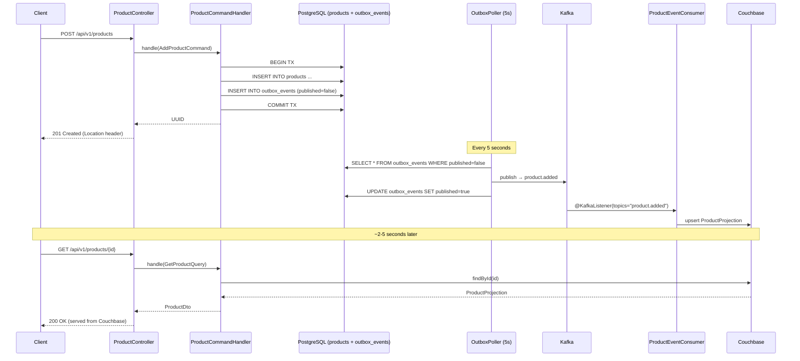
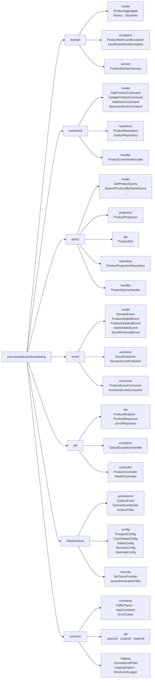

# Product Catalog Service

A production-ready **CQRS + DDD + Event-Driven** microservice built with Spring Boot 3.2, Java 21, PostgreSQL (write side), Couchbase (read side), and Kafka (event bus).

---

## Architecture

### CQRS Request Flow



---

### Component Diagram



---

### Transactional Outbox Pattern



---

### Package Structure



---

## Quick Start

### Local (Docker Compose)

```bash
docker compose -f docker-compose.poc.yml up --build
```

Then open [http://localhost:8080/swagger-ui/index.html](http://localhost:8080/swagger-ui/index.html).

### Cloud (Azure — zero local install)

See [POC_QUICKSTART.md](POC_QUICKSTART.md) — deploy entirely from your browser via Azure Cloud Shell.

---

## Sample Data

Ten products are seeded automatically by Flyway migration **V3** on first startup:

| # | Name | Price | Stock |
|---|------|------:|------:|
| 1 | Gaming Laptop Pro 16" | $1,499.99 | 25 |
| 2 | Wireless Noise-Cancelling Headphones | $299.99 | 80 |
| 3 | 4K UHD Smart TV 55" | $899.00 | 15 |
| 4 | Mechanical Keyboard RGB | $139.99 | 60 |
| 5 | Espresso Machine Barista Pro | $549.00 | 30 |
| 6 | Smart Air Purifier HEPA-13 | $199.99 | 45 |
| 7 | Adjustable Dumbbell Set 5-52 lb | $349.00 | 20 |
| 8 | Smart Fitness Tracker Band | $79.99 | 120 |
| 9 | Designing Data-Intensive Applications | $44.99 | 200 |
| 10 | Limited Edition Retro Console *(out of stock)* | $129.99 | 0 |

Product #10 has `stock_quantity = 0` so `inStock: false` will appear in the Couchbase projection — useful for demonstrating the search / filter endpoints.

---

## API Endpoints

| Method | Path | Auth | Description |
|--------|------|------|-------------|
| `POST` | `/api/v1/products` | ADMIN | Create product → writes to PostgreSQL |
| `PUT` | `/api/v1/products/{id}` | ADMIN | Update product |
| `POST` | `/api/v1/products/{id}/stock` | ADMIN | Add stock |
| `DELETE` | `/api/v1/products/{id}/stock` | ADMIN | Remove stock |
| `GET` | `/api/v1/products/{id}` | Public | Read from Couchbase |
| `GET` | `/api/v1/products` | Public | Paginated list from Couchbase |
| `GET` | `/api/v1/products/search?name=` | Public | Search by name (Couchbase) |
| `GET` | `/api/v1/health` | Public | Health check |

---

## Technology Stack

| Layer | Technology |
|-------|-----------|
| Language | Java 21 (LTS) |
| Framework | Spring Boot 3.2 |
| Write store | PostgreSQL 16 + Flyway migrations |
| Read store | Couchbase Community 7.2 |
| Event bus | Apache Kafka 3.6 (KRaft mode) |
| Security | Spring Security 6 + JWT (JJWT 0.12) |
| API docs | SpringDoc OpenAPI 3 (Swagger UI) |
| Build | Maven 3.9 + Docker multi-stage |
| Deployment | Azure Container Apps |

---

## Java 21 Features Used

- **Pattern matching** for `instanceof` checks in exception handlers
- **Records** for lightweight DTOs where applicable
- **Sealed classes** pattern for domain events (compile-time exhaustiveness)
- **Text blocks** for multi-line SQL in tests
- **Virtual threads** ready (enable via `spring.threads.virtual.enabled=true`)

---

## Environment Variables (Docker Compose POC)

| Variable | Default | Description |
|----------|---------|-------------|
| `POSTGRES_USER` | `catalog_user` | PostgreSQL username |
| `POSTGRES_PASSWORD` | — | **Required** |
| `COUCHBASE_USER` | `Administrator` | Couchbase admin user |
| `COUCHBASE_PASSWORD` | — | **Required** |
| `APP_JWT_SECRET` | — | Min 64 chars; used to sign JWTs |
| `SPRING_PROFILES_ACTIVE` | `poc` | Spring profile |
